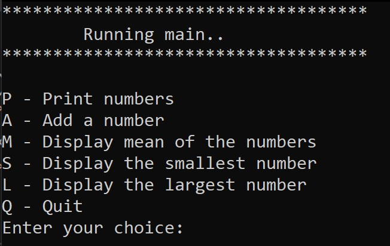

# cplusplusprojects
Please find here some programs or pieces of code that I developed using C++.  
I am mostly using Visual Studio to test these programs.

## Instructions
- Create a Fork of the repository (you can access all projects).
- Open your favourite IDE or directly a cmd.
- The only requirement would be to use C++ 20 (or higher).
  
## How to use
- Create your build and run .exe.
- Directly run ```main.exe``` inside any folder.

## Projects
Note that every folder will (unless otherwise noted) hold only one single program.
<em>List:</em>
- MenuSelections: Simple program to learn functions.

### Example of output:
Landing page:  


## Author and Licence
**[Juan Carcedo](https://github.com/JuanCarcedo)**  
2022 Copyright © - Licence [MIT](https://github.com/JuanCarcedo/cplusplusprojects/blob/main/LICENSE)
